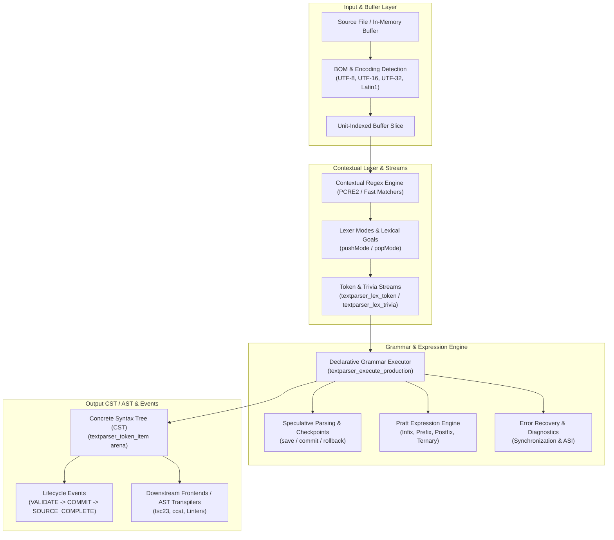

# TextParser Architecture & Specification

This document provides a comprehensive architectural specification of the `textparser` engine based on the reference **C codebase** (the "golden standard"). It explains the internal design, data structures, algorithms, lifecycle, and execution pipelines.

Developers creating or updating ports (Python, Rust, Java, Go, C#, etc.) must use this document and the C implementation in [`src/textparser.c`](src/textparser.c), [`src/textparser-json.c`](src/textparser-json.c), and [`include/textparser.h`](include/textparser.h) as the authoritative reference behavior and contract.

---

## 1. System Overview & Architecture Layers

`textparser` is an incremental syntax lexer, CST/AST constructor, and declarative grammar parsing engine designed for compilers, static analysis tools, linters, and syntax highlighters.

The engine operates on two complementary levels:
1. **Contextual Tokenization & Incremental CST Engine (Phase 1–3)**: Fast regex/state-machine-driven lexer that builds linked token trees, tracks source ranges, supports trivia (whitespace, comments), and performs sub-millisecond incremental re-parsing upon text edits.
2. **Declarative EBNF Grammar & Pratt Expression Engine (Phase 4–6)**: A transactional packrat/recursive-descent grammar executor supporting structured productions (`sequence`, `choice`, `optional`, `repeat`, `lookahead`, `commit`), scoped contexts, declarative guards and native predicates, Pratt top-down operator precedence expression parsing, robust synchronization recovery, and semantic lifecycle events.



---

## 2. Core Data Structures

The golden C definitions reside in [`include/textparser.h`](include/textparser.h).

### 2.1 Parser Handle (`textparser_t`)

The main handle (`struct textparser_handle`) encapsulates all parsing context, state, and resources:

* **Buffer & Encoding**: Pointer to mapped or allocated text buffer (`text_addr`), length (`text_size`), character encoding enum (`text_format`), BOM mask (`bom`), and optional file path (`filename`). Note that `TEXTPARSER_ENCODING_UTF_16` and `TEXTPARSER_ENCODING_UTF_32` operate on native host-endian code units (`uint16_t` / `uint32_t`), ensuring full compatibility across little-endian and big-endian (e.g. s390x) architectures.
* **Line Index Map**: Cached line starts (`lines`, `no_lines`) for O(log N) position-to-line/column mapping.
* **Arena Memory Allocator**: Chunks (`chunks`, `chunk_count`, `current_chunk`) allocating CST nodes and allocations with instant mass-free or checkpoint rollback.
* **Lexer Mode Stack & Goals**: Transient lexical modes (`mode_stack`, `mode_stack_depth` up to 64) and active lexical goal (`lexical_goal`).
* **Lexer Cache & Snapshots**: Immutable arrays of scanned syntax tokens (`lexer_tokens`) and trivia items (`lexer_trivia`).
* **Scoped Contexts & Predicates**: Linked lists of scoped variables (`contexts`) and registered native predicate functions (`predicates`).
* **Operator Precedence Table**: Registered Pratt operator rules (`operators`, `operator_count`).
* **Diagnostics Vector**: Collected errors, warnings, and hints (`diagnostics`, `diagnostic_count`).
* **Memoization Table**: Packrat memoization entries (`grammar_memo`) keyed by `(token_index, production_id)`.
* **Transactional State Snapshot**: Active runtime cursors (`parser.source_offset`, `parser.token_index`, `parser.speculation_depth`).

### 2.2 CST Node (`textparser_token_item` / `textparser_node`)

The CST is represented as a doubly-linked n-ary tree:

```c
typedef struct textparser_token_item {
    struct textparser_token_item *prev;    // Sibling before
    struct textparser_token_item *next;    // Sibling after
    struct textparser_token_item *child;   // First child
    struct textparser_token_item *parent;  // Enclosing parent node
    int token_id;                          // Token ID integer
    size_t len;                            // Node length in encoding units
    uint32_t text_color;                   // Theme foreground
    uint32_t text_background;              // Theme background
    uint32_t text_flags;                   // Formatting flags
    const char *error;                     // Node-specific error message

    /* Enhanced CST / AST properties */
    uint64_t id;                           // Monotonic stable 64-bit ID
    uint32_t node_flags;                   // Bitfield (SYNTHETIC, MISSING, RECOVERED, TRIVIA)
    const char *decoded_value;             // Decoded literal (e.g. unescaped string)
    void *user_data;                       // Host language / compiler payload
    void (*free_user_data)(void *);        // Destructor for user_data

    /* Schema-v2 CST identity and exact half-open source span */
    const char *cst_kind;                  // Canonical production / AST kind name
    size_t source_start;                   // Start unit offset
    size_t source_end;                     // End unit offset [source_start, source_end)
    textparser_cst_category category;       // Definition metadata; UNKNOWN uses structural fallback
} textparser_token_item;
```

Node identity: `id` is assigned from a per-handle monotonic counter
(`++handle->next_node_id`) and is never reused or compacted. This is deliberate,
not a leak: `id` is `uint64_t`, so wraparound would require 2^64 allocations, and
a stable ID lets callers key their own maps/attachments (`user_data`, AST nodes)
to a node across edits. In-place arena compaction (ROADMAP §1.3) preserves `id`;
reusing orphaned IDs would risk stale-ID collisions. `id` is distinct from
`token_id`, which is the grammar token kind.

#### Node Flags (`node_flags`)
* `TEXTPARSER_NODE_SYNTHETIC` (`1 << 0`): Synthesized node (e.g. ASI semicolon).
* `TEXTPARSER_NODE_MISSING` (`1 << 1`): Required grammar element that was absent and inserted for recovery.
* `TEXTPARSER_NODE_RECOVERED` (`1 << 2`): Node enclosing skipped malformed source text during synchronization.
* `TEXTPARSER_NODE_TRIVIA` (`1 << 3`): Whitespace or comment node attached as trivia.
* `TEXTPARSER_NODE_GRAMMAR_POSTFIX` (`1 << 4`): Intermediate expression tree markers.

CST category metadata is stored as `textparser_cst_category` on both production
records and emitted container nodes. Schema-v2 productions and inline constructs
accept an optional `category`: `unknown`, `token`, `source_file`, `declaration`,
`statement`, `expression`, `type`, `jsx`, `pattern`, or `other`:

```json
{"sequence": [{"token": "Identifier"}], "category": "declaration"}
```

The C API `textparser_node_get_category(node)` reads that metadata without
requiring a parser handle. Container creation copies the production category;
when a named choice renames an anonymous sequence, it also replaces its category.
Transparent references and choices that return an existing child retain that child's
category; token productions retain the token fallback. Omitted or `unknown` metadata
uses generic structural defaults: leaves are `TOKEN`, non-synthetic nodes with
children are `EXPRESSION`, and other containers or missing tokens are `OTHER`.
A null node returns `UNKNOWN`. No category is inferred from the language name or
CST kind spelling.

Productions and inline constructs can also specify `astKind` (e.g. `"astKind": "VariableDeclaration"`)
to override the emitted CST node kind independently of the production rule name. When omitted,
emitted CST kinds use the production rule name or structural defaults.
TypeScript family assignments live in `definitions/typescript_definition.json`;
the category API contains no hardcoded language-specific classification rules.

### 2.3 Lexer Stream Tokens & Trivia

When lexing completes, tokens and trivia are organized into two contiguous immutable vectors:

* **`textparser_lex_token`**:
  * `kind`: Token ID.
  * `start`, `end`: Source half-open range `[start, end)` in encoding units.
  * `leading_trivia_start`: Index into the trivia vector for preceding whitespace/comments.
  * `leading_trivia_count`: Number of trivia elements attached before this token.
  * `mode`, `lexical_goal`: Lexer mode and goal under which this token was scanned.
    The snapshot builder reconstructs `mode` by replaying the lexer rule
    `pop_mode`/`push_mode` transitions in document order (so it matches
    `textparser_contextual_scan_one`); `lexical_goal` is the default goal (`0`)
    for the legacy/incremental parse path, which has no grammar-scoped goal.
  * `flags`: e.g. `TEXTPARSER_LEX_FLAG_CONTAINS_LINE_TERMINATOR`.
  * `decoded_value`: Cached unescaped string or decoded payload.

* **`textparser_lex_trivia`**:
  * `kind`: Whitespace or comment token ID.
  * `start`, `end`: Half-open span.
  * `flags`: Contains `TEXTPARSER_LEX_FLAG_CONTAINS_LINE_TERMINATOR` if newline present.

The two vectors are owned by the handle and their capacity is retained across
incremental edits. A rebuild re-fills the existing buffers instead of freeing
and reallocating, and the in-leaf resize fast path patches the snapshot in place
(see §4.1 step 0). The buffers are only released on close or `textparser_set_text`.

---

## 3. Language Definition Model (Schema v2)

Language definitions can be loaded from JSON via `textparser_json_load_language_definition_from_json_file()` or compiled into static C headers using `json2h.py`.

The structure (`textparser_language_definition`) contains:
1. **Metadata**: `name`, `version`, `defaultTextEncoding`, `supportedBom`, `defaultFileExtensions`.
2. **Lexer Config**:
   * `tokens`: Map of token rules with `startRegex`, `endRegex`, `priority`, `isTrivia`, `pushMode`, `popMode`.
   * `modes`: Named token subsets active only when that mode is on top of the mode stack.
   * `goals`: Goal name mappings that remap scanned token IDs (e.g. remap `/` from `SlashToken` to `RegularExpressionLiteral`).
3. **Grammar Productions** (`textparser_grammar_definition`):
   * `start_production`: Entry-point production ID.
   * `productions`: Array of declarative productions (`textparser_production`).
4. **Operator Definitions** (`textparser_operator_def`):
   * Operators with role (`INFIX`, `PREFIX`, `POSTFIX`, `TERNARY`), numeric precedence (binding power), associativity (`LEFT` or `RIGHT`), and optional secondary token (e.g. `:` for `?`).
5. **Recovery Policy**:
   * `maximumDiagnostics`, `maximumSkippedTokens`, `maximumRecoveryAttempts`, and global `synchronizationTokens`.

---

## 4. Parser Execution Pipelines

### 4.1 Incremental Parsing & CST Patching (`textparser_parse_incremental`)

When text is edited, `textparser_parse_incremental` performs localized re-lexing:
0. **In-leaf resize fast path**: If the edit lies entirely within one leaf and
   re-matching that leaf's pattern at its start still consumes exactly the
   edited leaf length, only the leaf's length and its ancestors' lengths are
   updated; no re-scan happens. This prevents a greedy leaf (for example JSON
   `StringContent`) from being split into two adjacent leaves or from dropping
   its unchanged prefix. `out_range` covers the resized leaf. On a raw CST the
   retained lexer snapshot is patched in place (the edited entry's end and every
   later entry's offsets shift by the delta; kinds, trivia indices and modes are
   untouched); on a post-processed AST the snapshot is rebuilt instead, because
   post-processing may have changed token kinds relative to the snapshot. This
   applies to pure inserts, deletes, and same-length replacements that keep the
   leaf's pattern intact; anything else falls through to the steps below.
1. **Text Splicing**: Updates the internal memory buffer by inserting or deleting the delta range.
2. **Context Resolution**: Anchors at the **root** and re-tokenizes the
   top-level token containing the edit. Anchoring at the nearest container (or
   its parent) was insufficient because a token's match can depend on text
   outside its span (the JSON `Key` lookahead over its `:` sibling) or on its own
   start/end delimiter (a CFML `OutputStartTag` inside an `OutputTagPair`, where
   an edit in the tag name invalidates the pair). Re-tokenizing from the root
   re-evaluates every ancestor; the alignment below keeps the unchanged nodes, so
   tree mutation stays localized. Because the anchor is the root, the reparse
   always starts in the language's **initial lexical state**: the parser clears
   any `mode_stack`/`lexical_goal` left over from a previous parse or
   `textparser_execute_production` (`textparser_reset_lexical_state`) before
   re-tokenizing, so the anchor is state-safe for context-sensitive lexing.
3. **Token-boundary dirty region**: The reparse window starts at the **first
   sibling** of the anchor container, skips the container's start delimiter, and
   **extends to the last child before the container's end delimiter**.
   Re-tokenizing from the first sibling is required because a start token's end
   search has unbounded lookahead, so an edit can retroactively change the
   extent of an *earlier* top-level token (chained-edit fuzzing,
   `tmp/fuzzchain.cpp`). Re-tokenizing to the container end lets an overrun
   (greedy token or newly opened container) resync with the old suffix; the
   alignment below keeps the unchanged prefix/suffix nodes, so tree mutation
   stays localized. The container's own `otherTextInside` is used, not the
   language-level flag.
4. **Local Re-scan**: Re-lexes the window with the anchor's nested token rules,
   collecting the new sibling run into the per-handle **scratch arena**
   (`arena_reset(&handle->scratch)` at entry; no per-call heap traffic). A
   failed candidate inside a nested `otherTextInside` container emits one unit
   as `Unprocessed` and continues (matching the full parser); top-level errors
   link the partial token and fail.
5. **Suffix resync**: A greedy token or newly opened container can consume text
   past the old dirty end. The old suffix anchor is advanced to the token at the
   reparse's actual end (mapped back to old coordinates), so no overlapping or
   malformed leaves are stitched.
6. **Alignment / splice**: The old and new runs are aligned by kind, span, and
   mapped position. The unchanged common prefix and suffix keep their existing
   nodes; only the middle is replaced (add/delete/change on the linked list).
   This is what keeps `out_range` tight and preserves node identity. Sign
   merging runs after the splice so re-linking cannot undo it.
7. **Dirty Range Calculation**: Computes `out_range` (`dirty_start`, `dirty_end`) from the aligned changed span for editor syntax highlight invalidation.
8. **Memoization Shift**: The dirty lexer-token range is derived from the
   actually-changed tokens (`old_run[prefix .. count-suffix)`), not the reparse
   window, so unchanged suffix tokens keep their packrat memo entries. Shifts or
   invalidates entries intersecting that range
   (`textparser_memo_shift_and_invalidate`).
9. **AST mode re-derivation**: If the current tree was previously passed to
   `textparser_post_process`, the engine detects that (via the internal
   `TEXTPARSER_NODE_POST_PROCESSED` marker and/or synthesized `0x80000000`
   wrapper nodes), flattens the synthesized wrappers back into a raw CST before
   the splice (freeing the heap wrappers), and re-runs
   `textparser_post_process` on the updated tree. A tree that was never
   post-processed stays a raw CST, so the documented `textparser_parse` /
   `textparser_parse_incremental` contract is unchanged. A full-document reset
   edit preserves whichever mode the tree was in.

Arena reclamation: add/delete edits orphan the replaced nodes, which remain
resident until a full parse resets the arena. An abortable in-place
`textparser_compact()` for idle-time reclamation is specified in `ROADMAP.md`
§1.3 (not yet implemented).

Result: the incremental tree matches a full parse for all successful
single-character inserts and deletions on JSON, CFML, C, and JavaScript samples
(0 mismatches), with no incremental failures on valid input. Chained-edit
fuzzing on malformed input is down to 3 divergences (JSON 0/2980, CFML 0/2997,
C 1/2441, JavaScript 2/2494). **All 4 phases** of `ROADMAP.md` §1.5
(Sub-linear edit window) are implemented:
1. **Phase 1 (bounded forward-resync)**: after emitting each new leaf token past
   the dirty edit window, the engine compares it against the corresponding old
   sibling. When the two tokens match (same `token_id`, same `len`, both pure
   leaves — containers are excluded to preserve lookahead-dependent
   reclassifications), `end_pos` is clamped and the reparse stops early.
2. **Phase 2 (hierarchical position descent & span index)**: `span_len` tracking
   on `textparser_token_item` and bounds-pruned hierarchical descent in
   `find_token_at_position_internal`.
3. **Phase 3 (position bias for in-leaf snapshot shifts)**: in-leaf edits
   accumulate suffix offset changes lazily into `lexer_snapshot_bias` in O(1),
   avoiding O(n) passes over the snapshot on consecutive keystrokes until read
   or rebuilt.
4. **Phase 4 (scoped incremental AST post-processing)**: re-derivation of
   Pratt expression trees, template groups, and disambiguation is scoped to the
   modified subtree container when isolated.

The differential tests in `incremental_tests.cpp` (`DifferentialAgainstFullParse`,
`AllStructuralEditsMatchFullParseExactly`,
`CrossLanguageInsertsAndDeletesMatchFullParse`) guard against regressions.
Post-processed ASTs are covered separately by
`ProcessedAstIncrementalMatchesFullParse`, `IncrementalAstPostProcessScopedToEditWindow`,
`ExpressionPostProcessReDerivedOnIncrementalEdit`,
`CastDisambiguationReDerivedOnIncrementalEdit`,
`TemplateDisambiguationReDerivedOnIncrementalEdit`,
`PostProcessModeStickyAcrossFullReset`, and `RawCstStaysRawAfterIncrementalEdit`.

Full-parse performance is O(n) in the input size. Two O(n^2) traps must stay
closed: PCRE2 must not re-validate the whole subject on every match (the
thread-local `adv_regex_thread_utf8_valid` fast path set by
`adv_regex_set_utf8_valid`, which also covers the generated per-token search
functions' private contexts), and the single-line search bound is cached per
line (`line_cache_anchor` / `line_cache_end` in the handle, reset each parse).

### 4.2 Declarative Grammar Execution (`textparser_execute_production`)

The grammar executor executes declarative EBNF productions recursively or via dispatch:

| Production Kind (`textparser_production_kind`) | Semantic Behavior |
| :--- | :--- |
| `TEXTPARSER_PROD_TOKEN` | Matches and consumes a specific token ID from the lexer stream. Fails if the current token does not match. |
| `TEXTPARSER_PROD_REF` | Calls another production by referenced ID. Supports memoization. |
| `TEXTPARSER_PROD_SEQUENCE` | Matches an ordered list of child productions sequentially. If any child fails, the whole sequence rolls back (unless committed). |
| `TEXTPARSER_PROD_CHOICE` | Tries alternatives in order. Takes a checkpoint before each alternative. If an alternative fails without committing, rolls back and tries the next. |
| `TEXTPARSER_PROD_OPTIONAL` | Attempts child production once. If it matches, consumes; if not (and not committed), rolls back and succeeds without consuming. |
| `TEXTPARSER_PROD_REPEAT` | Repeatedly executes child production zero-or-more times until mismatch. Enforces forward progress to prevent infinite loops. |
| `TEXTPARSER_PROD_LOOKAHEAD` | Executes child production speculatively without advancing the parser cursor. Always rolls back token consumption. |
| `TEXTPARSER_PROD_NOT` | Negative lookahead. Succeeds only if child production fails; fails if child succeeds. |
| `TEXTPARSER_PROD_PREDICATE` | Evaluates a generic guard or a registered native callback without consuming tokens. A false condition fails the branch. |
| `TEXTPARSER_PROD_CONTEXT` | Pushes/sets a scoped context flag (e.g. `AllowAwait = 1`), executes child, and restores prior context value on exit. |
| `TEXTPARSER_PROD_COMMIT` | Marks the current choice branch as committed. Once passed, subsequent syntax errors in this branch cannot backtrack to sibling choices. |
| `TEXTPARSER_PROD_PRATT` | Invokes the Pratt expression parser with a given minimum binding power. |
| `TEXTPARSER_PROD_LEXICAL_GOAL`| Sets transient lexical goal while parsing child production. |

### 4.2.1 Declarative Grammar Guards

Declarative productions and inline constructs can specify `when` conditions for non-consuming lookahead evaluation without registering native C callbacks:

```json
{"when": {"noLineTerminatorBefore": true}}
{"when": {"nextTokenIn": ["Dot", "Semicolon"], "allowEOF": true}}
{"when": {"nextToken": "Identifier", "nextTokenText": "meta"}}
```

- **Conjunction**: Fields within a single `when` guard combine with logical AND.
- **Token Matching**: `nextToken` and `nextTokenIn` match token kind IDs. `nextTokenText` checks exact, case-sensitive raw spelling (not decoded identifiers) across UTF-8, UTF-16, and UTF-32 source encodings.
- **EOF Handling**: Token guards reject EOF by default unless `allowEOF: true` is explicitly enabled. A text condition (`nextTokenText`) always rejects EOF.
- **Trivia & Newline Guards**: `noLineTerminatorBefore` and `lineTerminatorBefore` inspect leading trivia before the candidate token. EOF is treated as having no preceding newline. Setting `lineTerminatorBefore: false` inverts the condition.
- **Source File Profiles**: Languages can define profile extensions under `grammar.sourceFileKinds`:
  ```json
  "sourceFileKinds": {
    "jsx": [".tsx", ".jsx"],
    "javascript": [".js", ".jsx", ".mjs", ".cjs"]
  }
  ```
  `{"when": {"sourceFileKind": "jsx"}}` matches any suffix in that profile, ignoring ASCII case (unnamed buffers match no profile).
- **Negation & Alternation**: Negate any guard using `{"not": {"when": ...}}`; alternative guards use standard `choice` constructs.
- **Lifecycle & Execution**: Generic `when` conditions compile to an optional `textparser_guard` on `textparser_production`. The loader resolves token names to IDs and copies profile suffixes into the guard; the executor evaluates them directly without string lookups or JSON parsing. Native callbacks remain supported as standalone `native` predicates.

---

## 5. Transactional Parser State & Speculative Parsing

Backtracking and speculative branching require absolute transactional isolation. A speculative failure must not leak memory, modified cursors, or orphan diagnostics.

### Checkpoints (`textparser_speculate_begin`, `textparser_speculate_commit`, `textparser_speculate_rollback`)

A checkpoint stores a complete snapshot of parser state:
* `source_offset` and `token_index`
* Lexer mode stack depth and lexical goal
* Scoped context variable map
* Arena memory allocation watermark (`textparser_arena_checkpoint`)
* Diagnostic count (discards diagnostics recorded in aborted branches)
* Pending lifecycle events count
* Active node ID counter

#### Transaction Workflow:
```c
void *cp = NULL;
textparser_speculate_begin(handle, &cp);

result = parse_alternative(...);

if (result.status == TEXTPARSER_MATCH_OK) {
    textparser_speculate_commit(handle, cp);
    publish_events();
} else if (result.committed) {
    // Committed: do not backtrack to another choice; report syntax error
    textparser_speculate_commit(handle, cp);
} else {
    // Ordinary mismatch: rollback everything
    textparser_speculate_rollback(handle, cp);
}
```

---

## 6. Pratt Expression Parsing (Top-Down Operator Precedence)

Expression parsing uses Pratt parsing (`textparser_parse_pratt_expression` / `parse_expression`) parameterized by operator binding powers.

### Operator Roles
1. **`TEXTPARSER_OP_PREFIX`**: Unary operators evaluated before operand (`!`, `-`, `~`, `typeof`, `await`).
2. **`TEXTPARSER_OP_POSTFIX`**: Unary operators evaluated after operand (`++`, `--`, `!`).
3. **`TEXTPARSER_OP_INFIX`**: Binary operators (`+`, `-`, `*`, `/`, `&&`, `||`, `===`, `as`).
4. **`TEXTPARSER_OP_TERNARY`**: Conditional operators (`? ... :`) using a secondary terminator token.

### Execution Loop
```c
left = parse_prefix_or_primary(parser);

while (has_next_operator(parser)) {
    op = peek_operator(parser);
    if (op.precedence < min_precedence)
        break;

    consume_operator(parser);
    if (op.role == TEXTPARSER_OP_TERNARY) {
        middle = parse_expression(parser, 0);
        consume(op.secondary_token_id); // e.g. ':'
        right = parse_expression(parser, op.precedence - (op.associativity == TEXTPARSER_ASSOC_RIGHT ? 1 : 0));
        left = make_ternary_node(op, left, middle, right);
    } else if (op.role == TEXTPARSER_OP_POSTFIX) {
        left = make_unary_postfix_node(op, left);
    } else { // INFIX
        next_min = op.precedence + (op.associativity == TEXTPARSER_ASSOC_LEFT ? 1 : 0);
        right = parse_expression(parser, next_min);
        left = make_binary_node(op, left, right);
    }
}
return left;
```

---

## 7. Error Recovery & Diagnostics

The engine avoids stopping at the first error or generating cascading diagnostic storms:

1. **Automatic Semicolon Insertion (ASI)**:
   * Semicolons can be omitted in JavaScript/TypeScript if at a newline (`has_preceding_line_terminator`), before a closing brace `}`, or at EOF.
   * The parser inserts a synthetic node marked `TEXTPARSER_NODE_SYNTHETIC | TEXTPARSER_NODE_MISSING` with zero width.
2. **Missing Token Insertion**:
   * If a required token is missing but the following tokens can proceed cleanly, a synthetic missing node is inserted.
3. **Synchronization Recovery (`textparser_recover_until_token`)**:
   * On production mismatch, the parser scans forward until encountering a token in the production's synchronization set (e.g. `;`, `}`, `class`, `function`).
   * Skipped source tokens are grouped into a node marked `TEXTPARSER_NODE_RECOVERED`.
4. **Furthest-Failure Diagnostics**:
   * If all choices in a union fail, the engine suppresses early dead-end errors and reports a diagnostic only at the furthest source offset reached across all speculative branches.

---

### 7.1 Declarative Diagnostic Messages

Tokens can supply a display `spelling`, and a language definition can specify diagnostic codes and message templates:

```json
"diagnostics": {
  "expected": {"code": "E_EXPECTED", "message": "Expected %s."},
  "tokenExpected": {"code": "E_TOKEN", "message": "'%s' expected."},
  "recovered": {"code": "E_RECOVERED", "message": "Recovered while parsing %s."}
}
```

For example, a lexer token can contain `"spelling": ";"`. Tokens may override
`diagnostics.expected`; productions and inline constructs may override
`diagnostics.expected` and `diagnostics.recovered`. Each template requires a
nonempty `code` and `message`.

- **Precedence**: Expected-error precedence is production override -> token override -> language `tokenExpected` (when a spelling exists) -> language `expected`. Recovery uses the production's `recovered` override or the language default.
- **Defaults**: With no configured template, default `TEXTPARSER_EXPECTED`/`TEXTPARSER_RECOVERED` apply; a token spelling supplies `'<spelling>' expected.`
- **Formatting**: Templates accept at most one `%s` and any number of `%%` escapes. `%s` receives the token spelling for expected-token errors, otherwise the expected element name or description. Recovery always uses the element description. A bounded formatter expands literal `%` and text without using definition strings as `printf` formats, adhering to a 255-byte limit.
- **Language Independence**: Diagnostic reporting (`textparser_grammar_report_expected()`), grammar synchronization recovery, and trailing unconsumed token diagnostics are completely language-independent. There are no language-specific checks hardcoded in `src/textparser.c`; diagnostic templates, spellings, recovery synchronization tokens, and boundary detection are driven entirely by declarative language definitions (`definitions/*.json`).


## 8. Semantic Lifecycle Events & AST Building

To allow downstream compilers (e.g. `tsc23`) to transform the generic CST into semantic ASTs without embedding compiler-specific code in the parser core, `textparser` emits four lifecycle events:

1. **`TEXTPARSER_EVENT_VALIDATE`**: Fired when a production matches. Must be purely side-effect free; can return `TEXTPARSER_ACTION_ACCEPT` or `TEXTPARSER_ACTION_REJECT`.
2. **`TEXTPARSER_EVENT_COMMIT`**: Fired once an enclosing speculative branch has successfully committed. State mutations are safe here.
3. **`TEXTPARSER_EVENT_RECOVERY`**: Fired when error recovery triggers or synthesizes nodes.
4. **`TEXTPARSER_EVENT_SOURCE_COMPLETE`**: Fired once the root start production completes and reaches EOF.

Lifecycle events are queued during speculative parsing and flushed only after the surrounding branch commits (`textparser_publish_pending_events`).

### 8.1 Decoupled Semantic Validation & Pratt Operand Validators

Pratt expression operand validation and AST early-error legality checks are decoupled
from the core parser into pluggable validators and language validation modules:

- **Pluggable Operand Validators:** Registered via `textparser_register_operand_validator(handle, name, fn, user_data)`.
  Pratt productions specify `"validateOperand": "typescript.assignmentTarget"` or `"typescript.updateTarget"`
  in JSON without embedding language-specific AST inspection in `src/textparser.c`.
- **Pluggable Token Validators:** Tokens in language definitions can specify `"validator": "validator_name"`
  (e.g., `"validator": "typescript.identifier"` on `Identifier` and `PrivateIdentifier`). The contextual
  lexer automatically invokes `textparser_validate_token()` during candidate rule evaluation.
- **Language Validation Modules:** Semantic validation logic is implemented in language-specific libraries
  under `src/validation/` (such as `libtextparser_typescript.so`, `libtextparser_php.so`, `libtextparser_cfml.so`,
  `libtextparser_html.so`, `libtextparser_css.so`, `libtextparser_sql.so`, `libtextparser_json_val.so`), exposing registration functions (e.g. `textparser_typescript_register_validators(handle)`,
  `textparser_sql_register_validators(handle)`, `textparser_json_register_validators(handle)`) and diagnostic extractors (e.g. `textparser_validate_typescript(handle)`,
  `textparser_validate_sql(handle)`, `textparser_validate_json(handle)`).
- **Event Lifecycle Dispatch:** Post-parse legality checks are triggered dynamically via grammar definition events
  (e.g. `"events": { "onSourceComplete": "typescript.legality" }` or `"events": { "onSourceComplete": "json.legality" }`).

---

## 9. Guidelines for Language Ports (Python, Rust, Java, etc.)

When creating or maintaining a port of `textparser`:

1. **Golden Standard Compliance**:
   * The C codebase is the normative behavioral reference. Output AST structures, token spans, node flags, and diagnostics must match the C engine byte-for-byte.
2. **Memory & Arena Management**:
   * C handles memory via chunked arenas. High-level ports (Rust, Python, Java) should either bind directly to `libtextparser` via FFI or replicate the transactional checkpoint/rollback semantics if writing a standalone implementation.
3. **Contextual Tokenization**:
   * Do not lex the entire source into a flat, stateless token array upfront. Languages like TypeScript and CFML require dynamic mode changes (`pushMode`, `popMode`) and lexical goals (`ExpressionStart` vs `ExpressionContinuation`) during scanning.
4. **Transactional Rollback**:
   * Speculative choice branches must discard all created nodes, errors, and mode mutations if the branch fails.
5. **Differential Verification**:
   * Validate port implementations against test suites in `tests/` and fixture suites under `tests/docker/fixtures/`.

### 9.1 Delimiter, trivia and unprocessed-token contract

The C engine synthesizes additional AST leaves that ports must reproduce. Both
the C JSON serializer (`cli/main.c`) and the Java `TokenItem` serializer hide
leaf `Whitespace` nodes, so the visible contract is defined by the following
rules (the in-memory CST still contains them):

1. **Start/end delimiters**:
   * Every `StartStop`/`StartOptStop` match begins with a `StartDelimiter` leaf
     (the matched start regex span) and, when an end token is found, ends with an
     `EndDelimiter` leaf (the matched end regex span).
   * The end delimiter takes priority over a nested child that starts at the same
     offset. This is why `**Bold**` parses as a single styled span rather than as
     a `Bold` container containing an `Italic` child.
2. **Unprocessed text**:
   * Text between delimiters that is not consumed by a nested token becomes
     `Unprocessed` leaves.
   * When the token has nested tokens, content is split on whitespace (one
     `Unprocessed` leaf per whitespace-separated run); the whitespace itself is
     represented internally as hidden `Whitespace` leaves.
   * When the token has no nested tokens, the content is emitted as a *single*
     `Unprocessed` span that includes internal and trailing whitespace. Leading
     whitespace is skipped (hidden `Whitespace` leaf), so the span starts after
     it.
   * At the top level, unmatched text is likewise split into whitespace-separated
     `Unprocessed` leaves.
3. **Delimiter pruning**:
   * When a start/stop token has **no** custom delimiter styling
     (`delimiterTextColor`, `delimiterTextBackground`, `delimiterTextFlags` all
     unset), the synthesized leaves are pruned only if the direct children are
     exactly `[StartDelimiter, Unprocessed, EndDelimiter]` or
     `[StartDelimiter, EndDelimiter]`, or a single `Unprocessed` span covering
     the whole token.
   * Because hidden `Whitespace` leaves count as direct children, any whitespace
     between the delimiters prevents pruning. Ports must therefore materialize
     whitespace nodes (or otherwise track whether whitespace was skipped) before
     applying the prune rule. The Java port materializes them, so it uses the
     same exact-children checks as C.
   * Custom delimiter styling disables pruning entirely.
4. **Multi-line validation**:
   * After a token is parsed, if its definition does **not** set `multiLine` but
     its span contains `\n` or `\r`, the parse must fail with
     *"Token spans multiple lines but multi_line flag is not set!"*.
   * This validation runs on every token, including `GroupOneChildOnly` wrappers
     around a multi-line child.
5. **Speculative error recovery**:
   * Nested-token attempts are speculative. If a nested attempt fails (throws /
     sets an error), the partial result is discarded. When the enclosing token
     allows arbitrary text (`otherTextInside`) and the failure did not occur at
     end-of-text, the offending character is emitted as an `Unprocessed` leaf and
     parsing continues from the next character.
   * At the top level, if every candidate start token fails, the first failure is
     reported as fatal (the parse is aborted) rather than being silently replaced
     by `Unprocessed`.
   * When `otherTextInside` is false and the top-level loop stops before consuming
     the whole input, the remaining input is emitted as a single `Unprocessed`
     span.
   * Candidate fallback: when a candidate start token (or nested child) fails
     *with an error*, the first such failure and its diagnostic are remembered,
     but the error state is cleared before the next candidate so the remaining
     candidates are still tried. The remembered failure is only re-applied when
     no candidate succeeds. The arena checkpoint for the failing candidate is
     intentionally **not** restored, so the remembered node stays valid.
     (This was a bug in C: the error leaked into later candidates, so the first
     failing candidate poisoned all others.)
   * Work budget: `textparser_parse_token` counts calls and aborts with
     *"Parse complexity limit exceeded!"* once a generous multiple of the input
     size (`text_size * 200 + 100000`) is exceeded. The candidate retry loop is
     exponential on deeply nested ambiguous input, so this bounds the worst
     case: a valid parse is O(text) and never reaches it, while pathological
     input terminates with an error instead of hanging. Once exceeded the budget
     is fatal — `otherTextInside` recovery is disabled so the parse does not
     continue one character at a time.
6. **Anchored matching and single-character advance**:
   * `textparser_find_token` compiles start patterns with `PCRE2_ANCHORED` and
     returns the first capture group's offset relative to the current position
     (normally `0`). It never scans ahead. A port must therefore check whether a
     token matches *at the current offset* only.
   * Container loops (`parse_token_group`, `parse_token_start_stop`,
     `parse_token_group_all_children_in_same_order`) attempt a nested token only
     when `find_token(...) == 0`; otherwise, when `otherTextInside` is set, they
     emit one character as `Unprocessed` and advance by one. This is what makes
     the engine linear in the input size. Scanning ahead for the nearest match
     (as an earlier Java implementation did) is both slower (O(n²)) and
     behaviourally different.
   * `GroupOneChildOnly` first tries candidates at offset `0`; only if none
     succeed does it look for the smallest positive capture-group offset, emit
     that prefix as `Unprocessed`, and parse the child there.
7. **Sign merging**:
   * `maybe_merge_sign` only absorbs a sign into a following number when the sign
     is a single character whose text is `+` or `-`. Other operators that happen
     to be listed in `signTokens` (for example `>&` in the Bash definition) are
     never absorbed.
   * The operand-context check walks backwards over trivia (`Whitespace`,
     `Unprocessed`, start/end delimiters) before testing `operandTokens`.
8. **`formatVersion: 2` (lexer-shaped) definitions**:
   * The C CLI does **not** run the declarative grammar for these definitions.
     Its JSON loader (`textparser-json.c`) normalizes `lexer.tokens` followed by
     `lexer.trivia` into the legacy `tokens` map, each as a `SimpleToken` whose
     `startRegex` is the lexer token's `regex`, and generates `startTokens` from
     all of them in JSON order. `multiLine` is carried over; `priority`,
     `pushMode`/`popMode`, modes and goals are ignored on this path.
   * Ports that only target CLI parity must reproduce this normalization, not the
     grammar engine. The grammar engine is reachable only through
     `textparser_execute_language_grammar`.
9. **Regex engine differences**:
   * `java.util.regex` does not know the PCRE2 derived properties `\p{ID_Start}`
     / `\p{ID_Continue}`; ports should rewrite them to the equivalent Unicode
     category sets (`\p{L}\p{Nl}` and `\p{L}\p{Nl}\p{Mn}\p{Mc}\p{Nd}\p{Pc}`).
   * Java's matcher is recursive, so long matches of loop patterns such as the
     TypeScript string/template literals can exhaust the thread stack where
     PCRE2 does not. A large-stack retry (or equivalent) is required.
10. **Error spans**:
    * The legacy parser stores `handle->error`, `handle->error_offset` and
      `handle->error_length`; `textparser_parse_error()` /
      `_position()` / `_length()` expose message + span. The span anchors at the
      token start for token-level errors (`Token spans multiple lines…`,
      `Token must have exactly one child…`), at the content start for
      `Can't find end of the token!`, and at the offending character (length 1)
      for unexpected/expected-token errors. Internal errors use length 0.
    * Full and incremental parsing share the same parser path, so the span is
      identical in both modes.
    * The grammar engine reports spans through `textparser_diagnostic`
      (`start_pos` + `length`). For a unified surface, the legacy error
      accessors fall back to the **first error-severity diagnostic** when
      `handle->error` is null, so callers get a message + span for both engines.
    * The Java port mirrors this with `ParseError` (`getPosition()` /
      `getLength()`), thrown by `TextParser.parse()`; the CLI prints
      `at offset N (length M)`.
